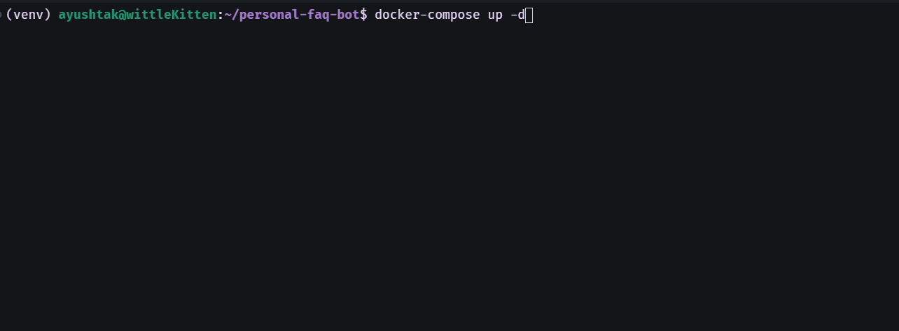

# Personal FAQ Bot (RAG with GPU)

This project is a personal FAQ chatbot built using the Retrieval-Augmented Generation (RAG) architecture. It leverages local HuggingFace embeddings on an NVIDIA GPU, FAISS for vector storage, and the Google Gemini API for generation. The entire application is containerized with Docker for easy setup and portability.

## ✨ Features

-   **RAG Pipeline:** Ingests documents, chunks them, and stores embeddings for semantic search.
-   **GPU-Accelerated Embeddings:** Uses `sentence-transformers` on a GPU for fast embedding generation.
-   **High-Performance Generation:** Connects to the Google Gemini API for fast and accurate answers.
-   **Vector Storage:** Employs FAISS for efficient in-memory similarity searches.
-   **FastAPI Backend:** Serves a simple and robust API for asking questions.
-   **Dockerized:** Fully containerized with Docker Compose for one-command setup, including GPU support.
-   **Secure:** Uses a `.env` file for API key management, ensuring secrets are not committed to source control.

## 🎬 Demo

Here is a quick demonstration of the API in action. The request is sent via `curl`, and the RAG pipeline provides a helpful answer based on the context from the source document.



## 🏗️ Project Structure
personal-faq-bot/
├── app/                # Main FastAPI application
├── data/               # Source documents (e.g., your CV, notes)
├── models/             # Folder for local models (if used)
├── vector_store/       # FAISS index storage (Git-ignored)
├── .env                # Environment variables (API keys)
├── .gitignore          # Git ignore file
├── Dockerfile          # Docker image definition
├── docker-compose.yml  # Docker service orchestration
├── README.md           # This file
├── ingest.py           # Script to process documents and create vector store
└── requirements.txt    # Python dependencies
## 🚀 Setup & Usage

### Prerequisites

-   Docker & Docker Compose
-   NVIDIA GPU with drivers installed
-   NVIDIA Container Toolkit (for Docker to access the GPU)

### 1. Clone & Configure

First, clone the repository to your local machine.
```bash
git clone [https://github.com/Ayush-Tak/personal-faq-bot.git](https://github.com/Ayush-Tak/personal-faq-bot.git)
cd personal-faq-bot
```
Create a .env file and add your Google Gemini API key. This file is git-ignored for security.
```bash
# Create your .env file manually or run:
echo "GOOGLE_API_KEY=your_gemini_api_key_goes_here" > .env

# Note: This file is git-ignored and will be automatically loaded by the app.
# You can also pass the key directly via environment variable in production:
#   docker run -e GOOGLE_API_KEY=your_key ...
```
2. Add Your Data

Place your personal Markdown (.md) files inside the data/ directory.

3. Build and Ingest Documents

This two-step process builds the Docker image and then runs the one-off ingestion script to create your vector store.
```bash
# 1. Build the main service image
docker-compose build

# 2. Run the ingestion script to create the vector store
docker-compose run --rm faq-bot python ingest.py
```
4. Start the API Server

Once ingestion is complete, start the main API service in the background.
```bash
docker-compose up -d
```
🧪 Example Usage

Once the API is running, wait for the application to start, you can send questions to the /ask endpoint using curl from your terminal.
You may use `docker-compose logs faq-bot` to check app status
```bash
curl -X POST "http://localhost:8000/ask" \
-H "Content-Type: application/json" \
-d '{
  "query": "What are Ayush Taks key projects?"
}'
```
Expected Response

You will receive a JSON response containing the answer and the source documents used to generate it.
```JSON
{
  "answer": "Movie Recommender (a TFIDF movie recommendation system based on cosine similarity using a dataset of over 40k movies) and RAG-Bot (a rag bot being built in FastAPI with a basic frontend).",
  "source_documents": [
    {
      "content": "About Ayush Tak\n\nProfessional Background\n\nAyush Tak is currently a student in MNIT Jaipur...",
      "metadata": {
        "source": "data/my_faq.md"
      }
    }
  ]
}
```

Finally to stop the container:
```bash
docker-compose down
```
### 📚 API Documentation

Once running, visit [http://localhost:8000/docs](http://localhost:8000/docs) to test the API via FastAPI’s Swagger UI.
